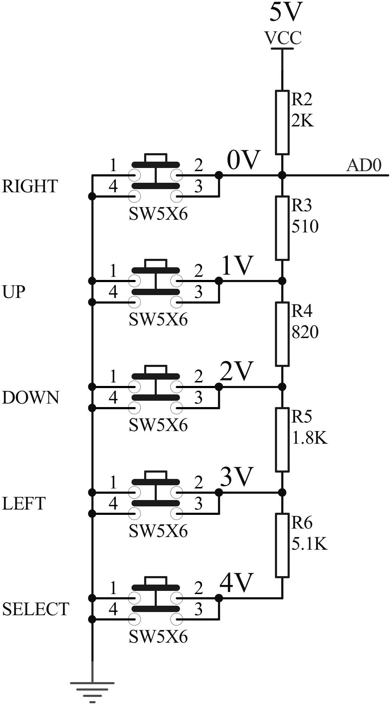

---
title: "Ćwiczenie 12: Obsługa klawiatury analogowej"
subtitle: "Instrukcja laboratorium"
footer-left: "Instrukcja laboratorium"
author: [Mariusz Chilmon <<mariusz.chilmon@ctm.gdynia.pl>>]
lang: "pl"
titlepage: yes
titlepage-logo: "logo.png"
logo-width: "70mm"
colorlinks: yes
header-includes: |
  \usepackage{awesomebox}
  \usepackage{algorithm}
  \usepackage{algpseudocode}
  \usepackage{tikz}
  \usepackage{xfrac}
  \usepackage{ellipsis}
  \usetikzlibrary{positioning}
  \usepackage[raster]{tcolorbox}
  \usepackage{lcd}
  \LCDcolors[MidnightBlue]{MidnightBlue!10}{MidnightBlue!80}
...

\lstset{language=[11]C++}

> Confusion is part of programming.
>
> — _Felienne Hermans_

# Cel ćwiczenia

Celem ćwiczenia jest zapoznanie się z:

* działaniem klawiatury analogowej,
* konwersją liczb na łańcuch znaków za pomocą biblioteki standardowej C i C++,
* zakresem typów całkowitych.

{width=250px}

Klawiatura analogowa wykorzystuje dzielnik napięciowy, sterowany za pomocą przycisków. Sygnałem wyjściowym jest napięcie, które może być zmierzone przez pojedynczy pin mikrokontrolera.

# Uruchomienie programu wyjściowego

1. Podłącz płytkę _LCD Keypad Shield_ do _Arduino Uno_.
1. Na wyświetlaczu widoczne są etykiety bez żadnych wartości.

\begin{center}
\LCD{2}{16}
    |ADC:     K:     |
    |COUNTER:        |
\captionof{figure}{Wyjściowy stan wyświetlacza}
\end{center}

# Zadanie podstawowe

Celem zadania podstawowego jest uzupełnienia sterownika klawiatury, tak by rozpoznawał aktualnie wciśnięty przycisk.

## Wymagania funkcjonalne

1. W polu \textLCD[0]{3}+ADC+ wyświetlana jest wartość odczytana z ADC.
1. W polu \textLCD[0]{1}+K+ wyświetlana jest nazwa wciśniętego przycisku.

\begin{center}
\LCD{2}{16}
    |ADC: 619 K: LEFT|
    |COUNTER:        |
\captionof{figure}{Stan wyświetlacza przy wciśniętym przycisku \textit{LEFT} (wartość odczytana z ADC może się nieznacznie różnić)}
\end{center}

## Modyfikacja programu

### Odczyt i wyświetlenie pomiaru z ADC

Metoda `Keypad::measure()` odczytuje wynik pomiaru z ADC, który w funkcji `printMeasure()` należy wypisać na wyświetlaczu w polu \textLCD[0]{3}+ADC+. W tym celu należy posłużyć się buforem `char buf[16]` oraz funkcją `snprintf()` z biblioteki \texttt{stdio.h}:

```
char buf[16];
snprintf(buf, sizeof(buf), "%4u", keypad.measure());
lcdDisplay.write(buf);
```

Na tym etapie otrzymujemy na ekranie:

\begin{center}
\LCD{2}{16}
    |ADC: 619 K:     |
    |COUNTER:        |
\captionof{figure}{Przykładowy stan wyświetlacza}
\end{center}

\awesomebox[teal]{2pt}{\faCode}{teal}{Zapis \lstinline{"\%4u"} oznacza cztery cyfry liczby całkowitej bez znaku.}

\awesomebox[teal]{2pt}{\faCode}{teal}{Funkcja \lstinline{snprintf()} jest bezpieczniejszą wersją funkcji \lstinline{sprintf()}, uwzględniającą rozmiar bufora, dzięki czemu nigdy nie nastąpi nadpisanie pamięci za buforem, gdyby wydrukowany napis się w nim nie mieścił.}

### Wyznaczenie przycisku odpowiadającego pomiarowi

Uzupełnij metodę `Keypad::currentKey()` o wyznaczenie aktualnie wciśniętego przycisku.

Mapowanie między pomiarem ADC a wciśniętym przyciskiem można zrealizować na dwa sposoby:

1. przeliczając każdy pomiar na napięcie, a następnie dopasowując zmierzone napięcie do napięć z klawiatury;
1. wyznaczając już na etapie kompilacji progi w postaci wartości pomiaru ADC i bezpośrednio je porównując.

Drugie rozwiązanie pozwala zaoszczędzić skomplikowanych obliczeń podczas pracy urządzenia i można je zapisać prosto w postaci ciągu instrukcji warunkowych. Korzystając ze wzoru na wartość pomiaru ADC w zależności od mierzonego napięcia $V_{IN}$ i napięcia referencyjnego $V_{REF}$ (tu: napięcia zasilania 5&nbsp;V):

\begin{equation}
ADC = \frac{V_{IN} \cdot 1024}{V_{REF}}
\end{equation}

otrzymujemy:

\begin{algorithm}
\caption{Rozpoznanie przycisku}
\begin{algorithmic}
\If {$measurement < \sfrac{0{,}5}{5} \cdot 1024$}
    \State \Return KEY\_RIGHT
\ElsIf {$measurement < \sfrac{1{,}5}{5} \cdot 1024$}
    \State \Return KEY\_UP
\ElsIf \dots
    \State \dots
\EndIf
\end{algorithmic}
\end{algorithm}

Wyznacz napięcia progowe dla poszczególnych przycisków z pomocą tabeli w sprawozdaniu.

### Wyświetlenie nazwy przycisku

W funkcji `printKey()` należy wypisać na wyświetlaczu w polu \textLCD[0]{1}+K+ nazwę aktualnie wciśniętego przycisku.

\begin{center}
\LCD{2}{16}
    |ADC: 619 K: LEFT|
    |COUNTER:        |
\captionof{figure}{Stan wyświetlacza przy wciśniętym przycisku \textit{LEFT} (wartość odczytana z ADC może się nieznacznie różnić)}
\end{center}

\awesomebox[teal]{2pt}{\faCode}{teal}{Możesz użyć ciągu instrukcji \lstinline{if}/\lstinline{else} lub instrukcji \lstinline{switch}/\lstinline{case}.}

# Zadanie rozszerzone

Celem zadania rozszerzonego jest wykorzystanie klawiatury do zmiany wartości licznika.

## Wymagania funkcjonalne

1. W polu \textLCD[0]{7}+COUNTER+ wyświetlana jest wartość licznika `static int16_t counter`.
1. Wciśnięcie przycisku _UP_ zwiększa stan licznika o 1.
1. Wciśnięcie przycisku _DOWN_ zmniejsza stan licznika o 1.
1. Wciśnięcie przycisku _SELECT_ ustawia stan licznika na 0.
1. Wciśnięcie przycisku _LEFT_ ustawia stan licznika na wartość minimalną.
1. Wciśnięcie przycisku _RIGHT_ ustawia stan licznika na wartość maksymalną.

\begin{center}
\LCD{2}{16}
    |ADC: 619 K: LEFT|
    |COUNTER:-32768  |
\captionof{figure}{Przykładowy stan wyświetlacza}
\end{center}

\awesomebox[teal]{2pt}{\faCode}{teal}{Aby ustawić minimalną i maksymalną wartość zmiennej typu \lstinline{int16_t}, użyj stałych \lstinline{INT16_MIN} i \lstinline{INT16_MAX} z biblioteki standardowej \texttt{stdint.h}.}

## Modyfikacja programu

### Reakcja tylko na wciśnięcie przycisku

Uzupełnij metodę `Keypad::oneTimeKey()`, tak by zwracała tylko zmianę stanu przycisku.

\begin{algorithm}
\caption{Reakcja tylko na wciśnięcie przycisku}
\begin{algorithmic}
\If {$currentKey() \neq lastKey$}
    \Comment{jeżeli zmienił się stan przycisku}
    \State $lastKey\gets currentKey()$
    \Comment{zapamiętaj nowy stan}
    \State \Return $lastKey$
    \Comment{zwróć nowy stan}
\Else
    \Comment{jeżeli wciąż ten sam przycisk}
    \State \Return KEY\_NONE
    \Comment{zwróć brak przycisku}
\EndIf
\end{algorithmic}
\end{algorithm}

\awesomebox[teal]{2pt}{\faCode}{teal}{Zmienna \lstinline{lastKey} jest dostępna jako właściwość obiektu \lstinline{Keypad} (\textit{vide} plik nagłówkowy \texttt{keypad.hpp}) — nie musisz jej definiować.}

### Zwiększanie i zmniejszanie licznika

W funkcji `handleCounter()` należy odpowiednio zmieniać i wyświetlać stan licznika.
